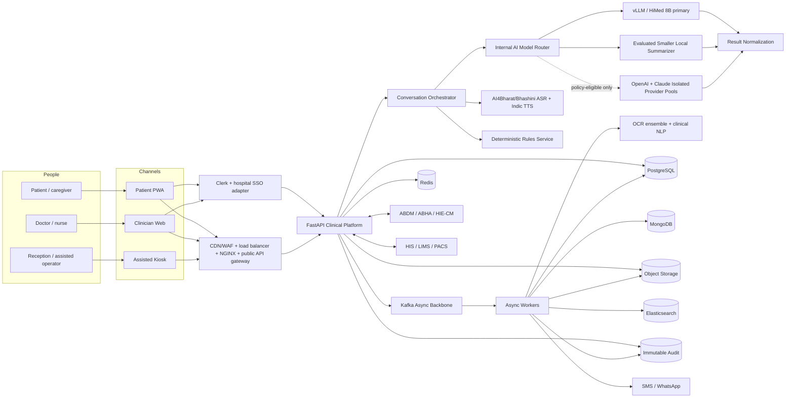
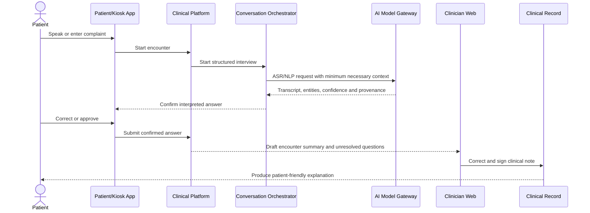

# Context Graph

This document answers two questions: what each folder owns, and how information moves through the system.

## Repository context

```mermaid
flowchart TD
    ROOT["patient-case-taking-platform"]
    ROOT --> APPS["apps: user-facing channels"]
    ROOT --> SERVICES["services: logical capabilities and extraction seams"]
    ROOT --> PACKAGES["packages: versioned shared contracts"]
    ROOT --> MODELS["model-assets: prompts, cards and evaluations"]
    ROOT --> INFRA["infrastructure: environments and operations"]
    ROOT --> DOCS["docs: decisions, plans and controls"]
    ROOT --> TESTS["tests: release evidence"]
    ROOT --> TOOLS["tools: local and migration utilities"]

    APPS --> PATIENT["patient-pwa"]
    APPS --> CLINICIAN["clinician-web"]
    APPS --> KIOSK["assisted-kiosk"]
    APPS --> OPS["operations-console"]

    SERVICES --> CORE["clinical-platform"]
    SERVICES --> CONV["conversation-orchestrator"]
    SERVICES --> AIGW["ai-model-gateway + vLLM runtime"]
    SERVICES --> MODELSVC["speech, clinical NLP and rules services"]
    SERVICES --> WORKERS["document, summary, alert and notification workers"]
    SERVICES --> ABDM["abdm-adapter"]

    PACKAGES --> API["api-contracts"]
    PACKAGES --> EVENTS["event-contracts"]
    PACKAGES --> FHIR["fhir-profiles"]
    PACKAGES --> AUTHZ["authorization"]

    DOCS --> PLAN["build roadmap"]
    DOCS --> SAFETY["clinical safety"]
    DOCS --> SECURITY["security and privacy"]
    DOCS --> ADR["architecture decisions"]

    TESTS --> CONTRACT["contract tests"]
    TESTS --> CLINICAL["clinical safety evaluations"]
    TESTS --> E2E["end-to-end workflows"]
```

## Runtime context

## Primary clinical flow

## Dependency direction

- Apps depend on public API contracts, never service internals.
- Workers consume versioned events and call owned service APIs where necessary.
- The AI gateway depends on safety policy and model configuration, not clinical database tables.
- The public API gateway cannot select a model/provider; only the internal model router may route to policy-approved local or external pools.
- ABDM and messaging providers are isolated behind adapters.
- Tests depend on published contracts and observable outcomes.
- Infrastructure deploys services but contains no clinical business rules.
