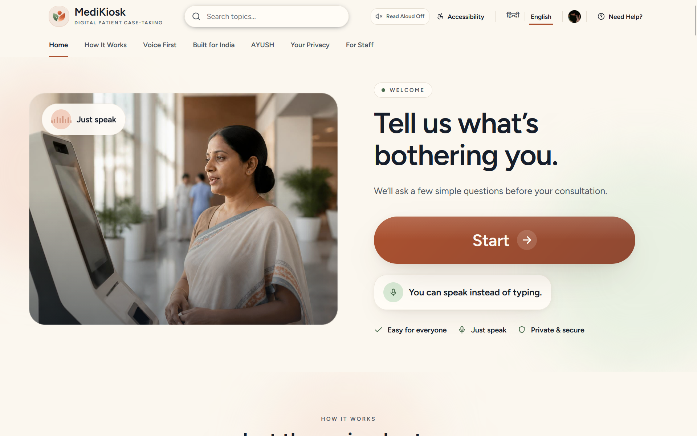
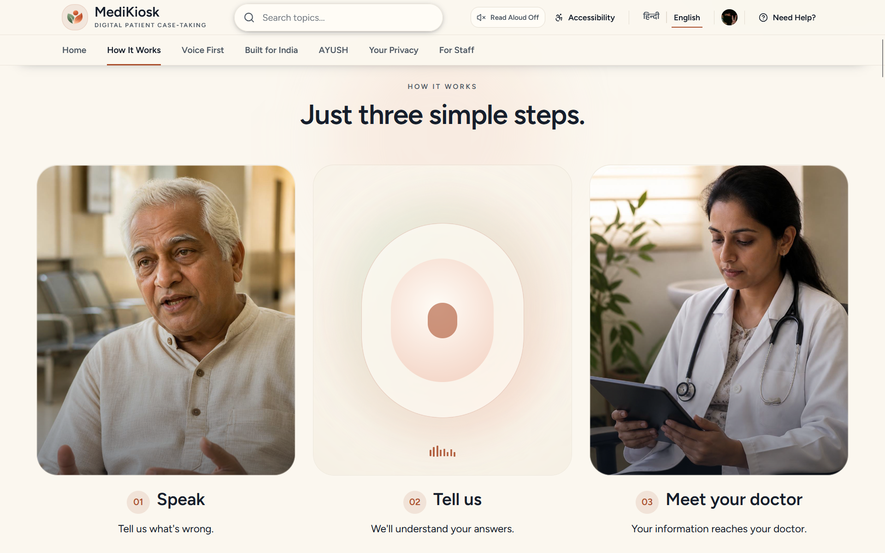
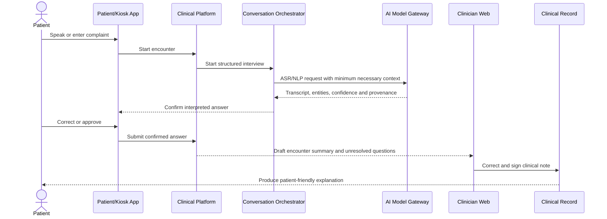

<div align="center">


</div>

<div align="center">
  
</div>

# Patient Case-Taking Platform

A multilingual, consent-driven patient case-taking platform for Indian hospitals — built for **Smart India Hackathon 2026**.

> **Goal:** reduce documentation burden while preserving informed consent,
> clinician accountability and patient comprehension. No impact target has yet
> been validated in a clinical deployment.

## Product Walkthrough

The patient can describe what is bothering them in their own words, while the
platform organizes the information for clinical review and keeps document
verification under staff control.

<table>
  <tr>
    <td width="50%" align="center">
      
      <br/><strong>1. Start with the patient's voice</strong>
    </td>
    <td width="50%" align="center">
      
      <br/><strong>2. Organize the patient's words</strong>
    </td>
  </tr>
  <tr>
    <td width="50%" align="center">
      
      <br/><strong>3. Connect the patient to care</strong>
    </td>
    <td width="50%" align="center">
      
      <br/><strong>4. Verify extracted documents</strong>
    </td>
  </tr>
</table>

---

##  Problem →  Solution

| The problem | What we build |
|---|---|
| Doctors spend **40% of consultation time** on paperwork | Voice-first case-taking that structures data as the patient speaks |
| Language barriers: 22+ official languages, code-switched speech | Hindi/English code-switched ASR + clinical NER |
| Paper records lose provenance and audit trails | Signed clinical notes where every assertion traces back to a spoken utterance |
| ABDM/ABHA integration is complex and often misimplemented | Native ABDM consent flows and patient-friendly summaries in the patient's language |

The clinician stays in charge throughout: AI drafts are suggestions, and nothing enters the signed record without clinician approval.

##  Quick Start

```bash
git clone https://github.com/shivamsingh-007/NotMID.git
cd NotMID/patient-case-taking-platform
cp .env.example .env
# Set the explicit workflow flags described in SETUP.md.
docker compose up --build
```

Open the patient experience at `http://localhost:3000`, the nurse dashboard at
`http://localhost:3001`, and the doctor review at `http://localhost:3001/doctor`.
The patient app now uses real local APIs for treatment consent, confirmed intake,
document upload status, reviewed-document timeline and clinician-signed reports.

> **Local engineering environment:** use synthetic information only. The Phase 8
> doctor screen uses the durable API, but this is not a clinical deployment.

Phase 6 Slice 6.1 adds a demo-only canonical deterministic triage evaluator at
`POST /api/v1/triage/evaluate`. It returns versioned prototype flags and
source-field paths, but it does not create a durable alert or establish clinical
validation.

For Windows instructions, frontend-only development, backend setup and troubleshooting, see [`SETUP.md`](SETUP.md).

---

## How It Works

Every encounter follows one loop: speak → confirm → structure → sign → explain.



<div align="center">
  
</div>

---

### Design Principles

1. **Patient safety is a release gate**, not a backlog item
2. **Clinician remains accountable** for signed clinical content
3. **ABHA is an external identifier**, not the internal primary key
4. **PostgreSQL is the transactional and clinical source of truth**
5. **MongoDB stores flexible raw AI artifacts, never signed clinical truth**
6. **Object storage holds immutable source documents** and audio
7. **Clinical dialogue and summary generation are mock-only and offline**; document OCR is a separate real PP-OCRv5 worker
8. **Every clinical assertion retains provenance**

### Tech Stack

| Layer | Technology |
|-------|------------|
| **Frontend** | Next.js + React + TypeScript, PWA-capable shared monorepo |
| **Backend APIs** | FastAPI + Pydantic + OpenAPI |
| **Realtime & async** | WebSockets + Kafka from MVP; Redis remains cache/session state |
| **Identity** | Clerk for staff/patient web surfaces; hospital SSO where available; constrained kiosk pre-auth |
| **Clinical summary provider** | Offline deterministic mock plus template fallback; no model downloads or external APIs |
| **Speech** | Existing ASR boundary + mock TTS by default; opt-in local AI4Bharat IndicF5 for Hindi speech |
| **Documents & NLP** | Real CPU PP-OCRv5 mobile worker, explicitly gated PaddleOCR-VL option, reviewed-fact extraction |
| **Rules** | Versioned Python rules service; Drools-style engine only if authoring complexity justifies it |
| **Data** | PostgreSQL, MongoDB, Redis, S3-compatible object storage, derived Elasticsearch |
| **Infrastructure** | Docker; Kubernetes for pilot/production; KServe/Ray Serve optional later |
| **Standards** | FHIR R4, ABDM APIs, OpenAPI 3.1 |
| **Observability** | OpenTelemetry, Prometheus, Grafana |

---

## Impact Targets

<div align="center">
  
</div>

---


--

## Team

| Role | Name |
|------|------|
| **Team Lead** | Shivam |
| **Backend Architect** | Yash |
| **Frontend Lead** | Aryan |
| **AI/ML Engineer** | Anushka |
| **DevOps & Infra** | Sakshi |
| **Clinical Safety & QA** | Tarun |

---

## Documentation

| Document | Purpose |
|----------|---------|
| [`SETUP.md`](SETUP.md) | Fresh-device setup, local development and dashboard usage |
| [`CONTEXT-GRAPH.md`](CONTEXT-GRAPH.md) | Repository & system context |
| [`BUILD-ROADMAP.md`](docs/plans/BUILD-ROADMAP.md) | Phased delivery plan |
| [`PHASE-6-RED-FLAG-TRIAGE.md`](docs/plans/PHASE-6-RED-FLAG-TRIAGE.md) | In-progress deterministic triage and durable alert implementation plan |
| [`PHASE-7-DOCUMENT-INGESTION-OCR.md`](docs/plans/PHASE-7-DOCUMENT-INGESTION-OCR.md) | Phase 7 implementation ledger, safety invariants and remaining rollout gates |
| [`PHASE-8-SUMMARY-WORKFLOW.md`](docs/plans/PHASE-8-SUMMARY-WORKFLOW.md) | Mock-only evidence-linked summary workflow and implementation ledger |
| [`PRE-PHASE-9-PATIENT-DASHBOARD-AND-S2S.md`](docs/plans/PRE-PHASE-9-PATIENT-DASHBOARD-AND-S2S.md) | Patient dashboard/services completion contract and verification ledger |
| [`PHASE-9-SEARCH-RETRIEVAL-LONGITUDINAL-CONTEXT.md`](docs/plans/PHASE-9-SEARCH-RETRIEVAL-LONGITUDINAL-CONTEXT.md) | Reviewed-record search, longitudinal context and measured implementation ledger |
| [`PATIENT-PORTAL-API.md`](docs/contracts/PATIENT-PORTAL-API.md) | Self-scoped consent, intake, upload, timeline and signed-report API |
| [`ADR-009`](docs/architecture/decisions/ADR-009-PATIENT-SELF-SCOPE-AND-MOCK-TTS.md) | Patient identity boundary and deterministic mock TTS decision |
| [`ADR-010`](docs/architecture/decisions/ADR-010-REBUILDABLE-CLINICAL-SEARCH.md) | Rebuildable, human-reviewed search projection decision |
| [`PHASE-9-SEARCH-RUNBOOK.md`](docs/operations/PHASE-9-SEARCH-RUNBOOK.md) | Search outage, reconciliation, tenant repair and benchmark procedure |
| [`medikiosk-change-ledger.html`](review/medikiosk-change-ledger.html) | Evidence-led Phase 5–9 engineering review |
| [`SYSTEM-ARCHITECTURE.md`](docs/architecture/SYSTEM-ARCHITECTURE.md) | Target architecture & request flows |
| [`TRAFFIC-CONTROL-AND-MODEL-ROUTING.md`](docs/architecture/TRAFFIC-CONTROL-AND-MODEL-ROUTING.md) | NGINX, gateway, uploads, provider routing & implementation slices |
| [`SERVICE-BOUNDARIES.md`](docs/architecture/SERVICE-BOUNDARIES.md) | Logical contexts, MVP deployables & extraction triggers |
| [`DATA-OWNERSHIP.md`](docs/architecture/DATA-OWNERSHIP.md) | Sources of truth & storage rules |
| [`DATA-MODEL.md`](docs/architecture/DATA-MODEL.md) | Conceptual Postgres, MongoDB, object & AYUSH model |
| [`EVENT-CATALOG.md`](docs/contracts/EVENT-CATALOG.md) | Async event conventions |
| [`RESILIENCE-PATTERNS.md`](docs/operations/RESILIENCE-PATTERNS.md) | Dependency fallbacks, retry, cache & rollout policy |
| [`CLINICAL-AI-SAFETY.md`](docs/safety/CLINICAL-AI-SAFETY.md) | Clinical AI safety gates |
| [`SECURITY-AND-PRIVACY.md`](docs/security/SECURITY-AND-PRIVACY.md) | Consent, access & PHI controls |

## Safety & Compliance

- **Clinical Safety**: Hazard log, test cases, approval evidence, incident review
- **Privacy**: Threat model, access reviews, key rotation, breach drills
- **Data Governance**: Migrations, quality rules, lineage, backup restoration
- **AI/ML**: Model cards, evaluation reports, drift & cost monitoring
- **Accessibility**: Field research, comprehension metrics, WCAG 2.1 AA

## Contributing

1. Read [`CONTEXT-GRAPH.md`](CONTEXT-GRAPH.md) and relevant subsystem `README.md`
2. Review API/event contracts and architecture decisions
3. Ensure clinical-safety and privacy requirements are met
4. Write tests proportional to risk
5. Include audit/observability coverage
6. Document failure/retry behavior and rollback notes

## License

Apache License 2.0 — see [`LICENSE`](LICENSE) for details.

---

*Built for Smart India Hackathon 2026 — Patient Case-Taking Platform Team*
"# NotMid" 
