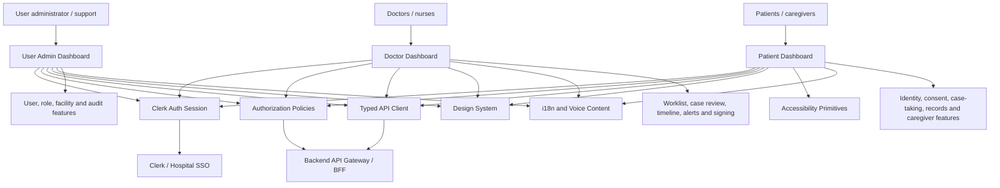
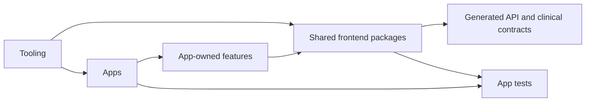

# Frontend Context Graph

```mermaid
flowchart TD
    USERS["User administrator / support"] --> ADMIN["User Admin Dashboard"]
    DOCTORS["Doctors / nurses"] --> DOCTOR["Doctor Dashboard"]
    PATIENTS["Patients / caregivers"] --> PATIENT["Patient Dashboard"]

    ADMIN --> AUTH["Clerk Auth Session"]
    DOCTOR --> AUTH
    PATIENT --> AUTH

    ADMIN --> AUTHZ["Authorization Policies"]
    DOCTOR --> AUTHZ
    PATIENT --> AUTHZ

    ADMIN --> API["Typed API Client"]
    DOCTOR --> API
    PATIENT --> API

    ADMIN --> DS["Design System"]
    DOCTOR --> DS
    PATIENT --> DS

    PATIENT --> A11Y["Accessibility Primitives"]
    PATIENT --> I18N["i18n and Voice Content"]
    DOCTOR --> I18N
    ADMIN --> I18N

    API --> GATEWAY["Backend API Gateway / BFF"]
    AUTH --> IDP["Clerk / Hospital SSO"]
    AUTHZ --> GATEWAY

    ADMIN --> ADMINF["User, role, facility and audit features"]
    DOCTOR --> DOCTORF["Worklist, case review, timeline, alerts and signing"]
    PATIENT --> PATIENTF["Identity, consent, case-taking, records and caregiver features"]
```

## Dependency graph

```mermaid
flowchart LR
    APPS["Apps"] --> FEATURES["App-owned features"]
    FEATURES --> SHARED["Shared frontend packages"]
    SHARED --> CONTRACTS["Generated API and clinical contracts"]
    APPS --> TESTS["App tests"]
    SHARED --> TESTS
    TOOLING["Tooling"] --> APPS
    TOOLING --> SHARED
```

Dependency direction is downward only. Shared packages must never import from applications.
